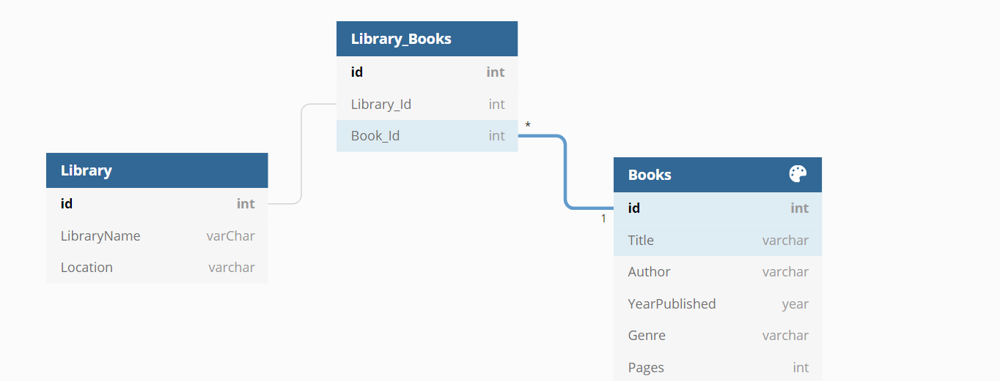

# Server-Side-Project

For this project we'll be using Node.js, express, knex, prostgreSQL to build our own book library database. 

For this project we created our own ERD to show the relationships between our models.
To build out the back-end we create database migratations using knex and build RESTful API routes that return data in a JSON format.

ERD: 